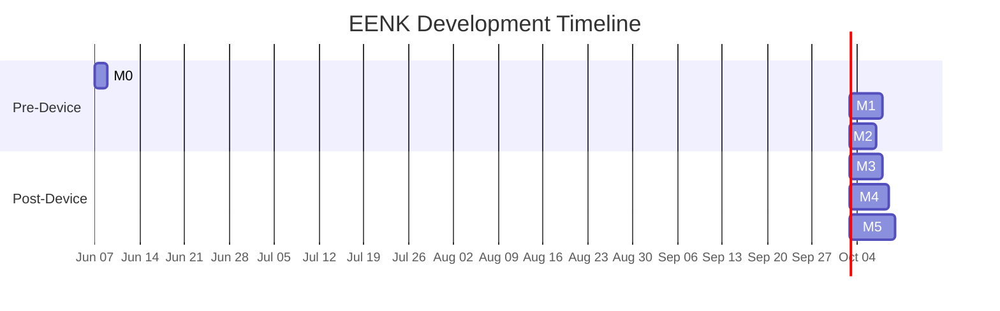

# EENK — Interactive Fiction Runtime for Xteink X4

## Overview

Transform the Xteink X4 e-reader into an interactive fiction console by embedding the **InkCPP** runtime into a fork of the **Papyrix Reader** firmware. The ultimate architecture (Option 3 — SPI Flash Memory Mapping) delivers zero-SRAM-impact execution of multi-megabyte ink games. We reach that goal incrementally through five milestones, starting with a desktop proof-of-concept and ending with a hardware-validated, optimized product.

---

## Emulation & Simulation Strategy

Since we don't have the physical device yet, we need a layered simulation approach. Rather than trying to perfectly emulate the Xteink X4's custom hardware (SSD1677 e-ink, resistor-ladder buttons) — which would require building custom QEMU peripherals or Wokwi custom chips — we adopt a **three-tier development strategy**:

### Tier 1 — Native Desktop (Primary Development Environment)

| Aspect | Detail |
|:---|:---|
| **Platform** | PlatformIO `[env:native]` — compiles with host GCC/MSVC |
| **Purpose** | All business logic, InkCPP integration, state machine, and text rendering pipeline |
| **Display** | SDL2 window (800×480 monochrome) simulating the e-ink framebuffer |
| **Input** | Keyboard mapping: Arrow keys → UP/DOWN/LEFT/RIGHT, Enter → CONFIRM, Escape → BACK |
| **Storage** | Local filesystem standing in for SD card; binary file I/O |

> [!TIP]
> This tier gives us **instant iteration** — sub-second build times, full debugger support, and visual output without needing any hardware or cloud services.

### Tier 2 — Wokwi ESP32-C3 Simulation (Hardware Validation)

| Aspect | Detail |
|:---|:---|
| **Platform** | Wokwi VS Code extension with ESP32-C3 board (free tier, license key in `.wokwi`) |
| **Purpose** | Validate firmware compiles and runs on real RISC-V target; test memory budgets |
| **Display** | **Stubbed** — serial/terminal logging renders a text-based mock of what the e-ink display would show |
| **Input** | Wokwi virtual buttons or potentiometers simulating ADC ladder |
| **Limitations** | No native SSD1677 support; requires internet connection (free tier) |

> [!NOTE]
> Wokwi validates that firmware fits in the ESP32-C3 memory budget and that FreeRTOS scheduling behaves correctly. The display is **stubbed via serial output** — a text-based mock showing narrative text, choices, and cursor position in the terminal. No attempt to visually emulate e-ink.

### Tier 3 — Physical Xteink X4 (Final Validation)

Only used once the device arrives. By then, the firmware should be functionally complete from Tiers 1 & 2, needing only calibration of ADC thresholds, display timing, and power management tuning.

---

## Resolved Questions

| Question | Resolution |
|:---|:---|
| **Q1: Papyrix License** | ✅ MIT — confirmed via [LICENSE](https://github.com/bigbag/papyrix-reader/blob/main/LICENSE). Free to fork and extend. |
| **Q2: Wokwi** | ✅ Free tier with license key (stored in `.wokwi`). Internet required for simulation. |
| **Q3: PoC Game** | ✅ Option B — start with a minimal "hello world" ink story, graduate to *The Intercept* once pipeline is validated. |
| **Q4: Device USB** | ✅ Developer edition ordered — USB unlocked for flashing. |

---

## Milestone Breakdown

---

### Milestone 0: Project Scaffolding & Toolchain Setup
**Goal:** Establish the build system, directory structure, and verify all tools work end-to-end.

#### Tasks
1. **Initialize PlatformIO project** with dual environments:
   - `[env:esp32c3]` — targets `esp32-c3-devkitm-1`, Arduino framework, 16MB flash
   - `[env:native]` — targets host machine for desktop simulation
2. **Clone & integrate InkCPP** as a local library under `lib/inkcpp/`
   - Configure build flags: `INK_ENABLE_STL=0`, `INK_ENABLE_CSTD=0`, no RTTI, no exceptions
   - Verify it compiles for both `native` and `esp32c3` environments
3. **Set up the ink compilation pipeline**
   - Install `inklecate` (via .NET tool or standalone binary)
   - Build or download `inkcpp_compiler` (`inkcpp-cl`)
   - Create a build script: `.ink` → (inklecate) → `.json` → (inkcpp_compiler) → `.bin`
4. **Create a minimal "hello world" ink story** and compile it to `.bin`
5. **Verify InkCPP loads and executes** the hello world story in the native environment (console output only)

#### Success Criteria
- [x] `pio run -e native` compiles cleanly
- [x] `pio run -e esp32c3` compiles cleanly (even if we can't flash yet)
- [x] Running the native binary prints "Hello world!" from the ink story

#### Estimated Effort: 1–2 days

---

### Milestone 1: Naive SRAM PoC — Desktop Simulation (Option 1)
**Goal:** End-to-end interactive fiction running in a desktop window, proving the InkCPP pipeline works with display + input.

#### Tasks

##### 1A: Hardware Abstraction Layer (HAL)
Create platform-agnostic interfaces so the same game logic runs on desktop and ESP32-C3:

```
src/
├── hal/
│   ├── IDisplay.h          # Abstract: clear(), drawText(), partialRefresh(), fullRefresh()
│   ├── IInput.h            # Abstract: pollInput() → enum {UP, DOWN, LEFT, RIGHT, CONFIRM, BACK, NONE}
│   ├── IStorage.h          # Abstract: readFile(), writeFile(), fileExists()
│   ├── sdl/
│   │   ├── SDLDisplay.cpp  # SDL2 800×480 monochrome window
│   │   ├── SDLInput.cpp    # Keyboard → button mapping
│   │   └── SDLStorage.cpp  # std::fstream
│   └── esp32/
│       ├── EInkDisplay.cpp # SSD1677 driver (wraps Papyrix's GfxRenderer)
│       ├── ADCInput.cpp    # Resistor ladder ADC polling
│       └── SDCardStorage.cpp # SD card via SPI
```

##### 1B: Ink Game Engine
Implement the core game loop using InkCPP:

```
src/
├── engine/
│   ├── InkEngine.h/.cpp    # Wraps InkCPP story + runner lifecycle
│   ├── GameState.h/.cpp    # Manages narrative state, choice selection, scroll position
│   └── TextFormatter.h/.cpp # Wraps text to display width, handles pagination
```

Key behaviors:
- Load `.bin` from storage via `story::from_binary()` into SRAM (naive allocation)
- Game loop: `getline()` → format text → display; `has_choices()` → render choice menu → `choose(index)`
- UP/DOWN cycles through choices, CONFIRM selects, BACK shows save dialog

##### 1C: SDL Desktop Renderer
- 800×480 SDL2 window with monochrome (black text on white) rendering
- Use a basic bitmap font for desktop (we won't integrate Papyrix's `.epdfont` system yet)
- Simulate partial refresh behavior (only redraw changed text regions)
- Render choice highlighting (inverted colors for selected choice)

##### 1D: Integration Test with The Intercept
- Compile *The Intercept* through the full pipeline (`.ink` → `.json` → `.bin`)
- Play through at least 3 branching paths in the desktop simulator
- Verify: no crashes, correct text rendering, choices work correctly

#### Success Criteria
- Interactive fiction playable in an SDL2 window
- UP/DOWN scrolls choices, CONFIRM advances narrative, BACK saves
- *The Intercept* runs end-to-end without memory errors
- Memory profiling: document exact SRAM usage of The Intercept story data

#### Benchmarks to Capture
| Metric | Target |
|:---|:---|
| Story load time (native) | < 50ms |
| Memory usage (story data) | Document exact bytes |
| Memory usage (runner state) | Document exact bytes |
| Text rendering latency | < 16ms per frame |
| Full playthrough stability | Zero crashes over 50+ choices |

#### Estimated Effort: 3–5 days

---

### Milestone 2: ESP32-C3 Cross-Compilation & Memory Validation
**Goal:** Validate that the firmware compiles and the memory budget works on the real target architecture using Wokwi serial simulation.

> [!IMPORTANT]
> **User Review Required:** As discussed, we are bypassing the Papyrix e-ink framework for this milestone. We will implement `IDisplay` and `IInput` using the ESP32's `Serial` interface (using ANSI escape codes to render the UI in the Wokwi terminal). This lets us purely validate the InkCPP memory constraints on the RISC-V architecture without getting bogged down by display drivers.

#### Tasks

##### 2A: ESP32 Hardware Abstraction (Serial Stub)
- **`EspSerialDisplay`**: Implements `IDisplay` using `Serial.print` and VT100/ANSI escape codes to clear the screen and position the cursor, simulating a terminal-based UI.
- **`EspSerialInput`**: Implements `IInput` by polling `Serial.read()` for navigation keys (e.g., `w`/`s` for arrows, `Enter` to confirm).
- **`EspLittleFSStorage`**: Implements `IStorage` using the Arduino `LittleFS` library to load the `.bin` story file from the flash partition.

##### 2B: Build System Configuration
- Configure `platformio.ini` `[env:esp32c3]` to build a LittleFS data image.
- Move `the_intercept.bin` into a `data/` directory so PlatformIO bundles it.
- Compile the runtime for ESP32-C3, ensuring all `INKCPP_NO_STD` flags function correctly against the toolchain.

##### 2C: Wokwi Memory Validation
- Add `esp_get_free_heap_size()` logging before and after story load.
- Boot the simulation in Wokwi.
- Verify that the ~147 KB story binary loads successfully into ESP32 SRAM, leaving sufficient heap (~150 KB) for the `InkEngine` and RTOS overhead.

> [!WARNING]
> The ~84 KB safety buffer is dangerously thin. This milestone **must** capture actual heap usage via `esp_get_free_heap_size()` to confirm viability. If it's tighter than expected, we accelerate Milestone 4 (flash mapping).

##### 2D: Wokwi Validation (if subscription available)
- Create `wokwi.toml` and `diagram.json` for ESP32-C3
- Run firmware in Wokwi, observe serial output of ink game
- Capture `esp_get_free_heap_size()` readings at key points

#### Success Criteria
- Firmware compiles for `esp32c3` target with no errors
- Static analysis shows firmware binary < 3 MB
- Memory budget analysis complete with actual numbers
- If Wokwi available: game runs in simulation with serial output

#### Estimated Effort: 3–4 days

---

### Milestone 3: Physical Device Bring-Up & E-Ink Rendering
**Goal:** Game running on actual Xteink X4 hardware with e-ink display and physical buttons.

> [!NOTE]
> This milestone is **blocked** until the device arrives. All prior milestones are designed to minimize work needed here.

#### Tasks

##### 3A: Device Setup & Flash
- Verify USB-C port is unlocked for flashing
- Flash the forked Papyrix firmware via `papyrix-flasher` or PlatformIO direct upload
- Confirm baseline Papyrix functions (EPUB reading works)

##### 3B: Ink Game on E-Ink
- Integrate InkGameState into the running firmware
- Wire text output through Papyrix's `GfxRenderer` + Knuth-Plass line breaking
- Implement partial refresh strategy:
  - New text lines → partial refresh
  - Choice selection changes → partial refresh (just the cursor)
  - Every 15 partial updates → full refresh (ghosting mitigation)
  - Power down display controller after each refresh (sunlight fading fix)

##### 3C: ADC Input Calibration
- Calibrate voltage thresholds against actual resistor ladder values
- Tune debounce timing (target: 20ms)
- Map: UP/DOWN = scroll choices, CONFIRM = select, BACK = save/exit, LEFT/RIGHT = scroll text

##### 3D: Power Management
- Enter deep sleep between user inputs (ink engine is idle while waiting for choice)
- Wake on GPIO interrupt from resistor ladder
- Benchmark battery draw during active play vs. idle

#### Success Criteria
- *The Intercept* playable on physical device with beautiful e-ink typography
- Button input responsive with no false triggers
- Partial refresh working (no full-screen flash between choices)
- Battery benchmark: > 8 hours of continuous interactive play

#### Estimated Effort: 3–5 days (after device arrives)

---

### Milestone 4: Flash Memory Mapping — Option 3 (Production Architecture)
**Goal:** Eliminate the SRAM bottleneck entirely. Games up to 10+ MB run with zero SRAM impact.

#### Tasks

##### 4A: Partition Table Engineering
Modify `partitions.csv`:

```csv
# Name,    Type, SubType, Offset,   Size
nvs,       data, nvs,     0x9000,   0x5000
otadata,   data, ota,     0xe000,   0x2000
app0,      app,  ota_0,   0x10000,  0x300000
ink_cache, data, 0x82,    0x310000, 0xA00000
spiffs,    data, spiffs,  0xD10000, 0x2F0000
```

This reserves **10 MB** for the `ink_cache` partition.

##### 4B: SD → Flash Bridge
Implement the data bridging routine:
1. User selects `.bin` file from SD card via Papyrix UI
2. Compare MD5 hash of SD file vs. stored hash in NVS
3. If mismatch: `esp_partition_erase_range()` → `esp_partition_write()` in 4 KB chunks
4. Show progress bar on e-ink during transfer
5. Store file hash + size in NVS for future comparisons

##### 4C: Memory Mapping
```cpp
const esp_partition_t* partition = esp_partition_find_first(
    ESP_PARTITION_TYPE_DATA, 0x82, "ink_cache");

spi_flash_mmap_handle_t mmap_handle;
const void* mapped_ptr;

esp_partition_mmap(partition, 0, file_size,
    SPI_FLASH_MMAP_DATA, &mapped_ptr, &mmap_handle);

// Zero-copy: pass directly to InkCPP
auto story = ink::runtime::story::from_binary(
    static_cast<const unsigned char*>(mapped_ptr),
    file_size,
    false  // DO NOT free — it's memory-mapped
);
```

##### 4D: Cleanup & Lifecycle
- `spi_flash_munmap(mmap_handle)` when game exits
- Handle edge cases: corrupted flash, interrupted writes, insufficient partition space
- Fallback to naive SRAM for tiny stories (< 50 KB) to avoid unnecessary flash writes

#### Success Criteria
- *The Intercept* runs via flash mapping with **0 bytes** of story data in SRAM
- `esp_get_free_heap_size()` shows ~200+ KB free during gameplay
- A synthetic 2 MB test story loads and runs correctly
- Flash write/erase performance: < 10 seconds for a 1 MB story
- 100 load cycles with no flash corruption

#### Benchmarks to Capture
| Metric | SRAM (M1) | Flash Map (M4) |
|:---|:---|:---|
| Free heap during gameplay | ~84 KB | ~200+ KB |
| Max story size supported | ~150 KB | ~10 MB |
| Story load latency | Instant | ~5-10s (first load) |
| Execution latency per choice | ~0ms | ~0ms (hardware cached) |

#### Estimated Effort: 4–6 days

---

### Milestone 5: Polish, Save System & Game Library
**Goal:** Production-quality UX with save/load, multiple game support, and battery optimization.

#### Tasks
1. **Save/Load System**
   - `runner.create_snapshot()` → serialize to `.snap` file on SD card
   - Auto-save on BACK button press and before deep sleep
   - Resume from snapshot on game re-open
2. **Game Library UI**
   - Browse `.bin` files on SD card from Papyrix home menu
   - Show game title (extracted from ink metadata if available)
   - Show save status indicator (✓ = has save, ● = in progress)
3. **Multi-game flash management**
   - Cache invalidation when switching games
   - Hash-based skip if game already in flash
4. **Typography polish**
   - Full integration with Papyrix's Knuth-Plass line breaking
   - Hyphenation support for narrative text
   - Choice rendering with clear visual hierarchy (numbered bullets, highlight bar)
5. **Power optimization**
   - Deep sleep between inputs with GPIO wake
   - Aggressive display controller power-down
   - Target: weeks of standby, 8+ hours active play on 650 mAh battery

#### Estimated Effort: 5–7 days

---

## Project Directory Structure

```
eenk/
├── platformio.ini              # Dual-env: esp32c3 + native
├── partitions.csv              # Custom partition table (M4)
├── stories/                    # Source .ink files and compiled .bin files
│   ├── hello_world.ink
│   ├── hello_world.bin
│   ├── the_intercept.ink
│   └── the_intercept.bin
├── tools/
│   └── compile_ink.py          # .ink → .json → .bin pipeline script
├── lib/
│   └── inkcpp/                 # InkCPP runtime source
├── src/
│   ├── main.cpp                # Entry point (env-specific via #ifdef)
│   ├── hal/
│   │   ├── IDisplay.h
│   │   ├── IInput.h
│   │   ├── IStorage.h
│   │   ├── sdl/                # Native desktop implementations
│   │   └── esp32/              # ESP32 + Papyrix implementations
│   ├── engine/
│   │   ├── InkEngine.h/.cpp
│   │   ├── GameState.h/.cpp
│   │   └── TextFormatter.h/.cpp
│   └── ui/
│       ├── ChoiceRenderer.h/.cpp
│       ├── NarrativeView.h/.cpp
│       └── GameLibrary.h/.cpp
├── test/
│   ├── test_native/            # Desktop unit tests
│   └── test_device/            # On-device integration tests
└── docs/
    └── intial research.md      # Existing research document
```

---

## Risk Register

| Risk | Impact | Likelihood | Mitigation |
|:---|:---|:---|:---|
| InkCPP won't compile for ESP32-C3 RISC-V | **High** | Low | InkCPP targets minimal C++; resolve at M0 before investing further |
| SRAM too tight even for small stories | Medium | Medium | Accelerate M4 (flash mapping); skip M3 SRAM approach |
| Papyrix architecture changed since research | Medium | Low | Verify repo structure at M0; adapt HAL wrappers accordingly |
| USB port locked on purchased device | **High** | Medium | Verify before purchase; use SD-card flash method as fallback |
| Wokwi can't adequately simulate ESP32-C3 | Low | Low | Tier 1 (native desktop) is our primary dev environment anyway |
| Flash memory mapping latency worse than expected | Low | Low | Hardware cache should make this negligible; benchmark at M4 |
| InkCPP runner state exceeds 20 KB estimate | Medium | Medium | Profile at M1; if needed, reduce runner stack depth or optimize |

---

## Verification Plan

### Automated Tests
- **Unit tests** (`pio test -e native`): InkEngine state machine, TextFormatter word-wrap, choice cycling
- **Integration tests**: Full pipeline — compile ink → load binary → run to completion → verify output text
- **Memory profiling** (ESP32): `esp_get_free_heap_size()` at init, after story load, during gameplay, at peak choice depth

### Manual Verification
- **Desktop PoC** (M1): Visual inspection of SDL window — text readability, choice highlighting, scroll behavior
- **Device testing** (M3): Physical button responsiveness, e-ink refresh quality, ghosting threshold tuning
- **Stress testing** (M4): Load progressively larger stories (10 KB → 100 KB → 1 MB → 5 MB) and verify stability

---

## Recommended Execution Order



> [!NOTE]
> Milestones 0–2 can proceed **immediately** without hardware. M3–5 require the physical device but benefit enormously from all the validation done in M0–2.
